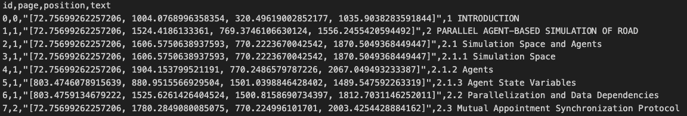

# Pdformer

This is the readme file for the Pdformer.

## Introduction

> **When everyone digs for gold, sell shovels.**

When different kinds of large models are attached great importance to, we want to buiild a data loader and cleaner for different kinds of information formats (among which, PDF is one of the most complex ones) with relevant experts(Mixture of Experts), before inputed into LLMs. Our object is that users can diy their input and prompt, namely Retrieval Augmented Generation(RAG).

This is mainly a PDF document content extractor at present. Our work is based on existing open-source projects, combining techs like OCR and layout analysis. The pipeline is as follows:


## Install

python == 3.10

```python
pip install -r requirements.txt
```

Also need to install the PaddlePaddle for the layout analysis.

```python
python3 -m pip install paddlepaddle -i https://mirror.baidu.com/pypi/simple
```

## How to use

Find the ***conf.py*** under **`"input/config/"`**, and freely modify the default values.

#### **Loading a PDF and run**

**`input_directory`**: the default input directory is under **`"input/"`**.

Put the pdf file under **`"input/example/"`**, change the value of pdf_name to the name of the pdf (ex: for **test.pdf**, pdf_name = "test")

Run the ***run_pdformer.py*** under **`"script/"`**

#### **Outputs**

- **`output_directory`**: the default output directory is under **`"output/pdf_name/"`**.
- **`pics_directory`**: the default pics directory is under **`"output/pdf_name/pics/"`**, which contains pictures of the pdf file.
- **`structure_directory`**: the default structure directory is under **`"output/pdf_name/structure/"`**, which contains the result of the layout analysis.

##### **Result.json**

- ***result.json*** (structured json) is under **`"output/pdf_name/results/"`**.

  

  The `title_nodes` are like: 

  ```python
  {"node_type": 0, "id": title_id, "level":title_level , "text": title_text, "children": []}
  ```

  Other types of nodes are like:

  ```c
  {"node_type": 1, "id": text_id}
  ```

  All the subtitles and content will be contained in the `children` list of their parent titles.

  

  Here is a snippet of the ***result.json*** for ***test.pdf***:

  ```json
    {
      "node_type": 0,
      "id": 9,
      "level": 1,
      "text": "3 ADAPTIVE COMPUTATION REPLICATION",
      "children": [
        {
          "node_type": 1,
          "id": 30
        },
        {
          "node_type": 1,
          "id": 31
        },
        {
          "node_type": 1,
          "id": 32
        },
        {
          "node_type": 0,
          "id": 10,
          "level": 2,
          "text": "3.1 Extended Layers on the Network",
          "children": [
            {
              "node_type": 3,
              "id": 0
            },
            {
              "node_type": 0,
              "id": 11,
              "level": 3,
              "text": "3.1.1 One Extended Layer",
              "children": []
            },
  ```

  It can be seen from the snippet that a hierarchical nesting structure is built using a combination of `node_type`, `id`, `level`, `text`, and `children` attributes. The top-level title, "3 ADAPTIVE COMPUTATION REPLICATION" is represented as a node with `node_type = 0` and `level = 1` , indicating its position in the hierarchy;

  Nested within this top-level node are several children nodes. Among these children, there's a nested title "3.1 Extended Layers on the Network" with `level = 2`; Further nesting is "3.1.1 One Extended Layer", which has  `level = 3`, indicating it is a sub_section of "3.1 Extended Layers on the Network".


##### **Meta_csv**

- Meta_csvs are also under **`"output/pdf_name/results/"`**. Five categories of data are collected from the pdf file, namely `title`, `text`, `list`, `table` and `figure`. 

- Csvs for ***test.pdf*** have columns like  `id`, `page`, `position` and `text`. With the attribute id, the csv and the nodes in ***result.json*** can be connected, and the `position` and `text` are collected together in csv files.

  The csv for titles is shown below.

***Meta_title.csv:***



